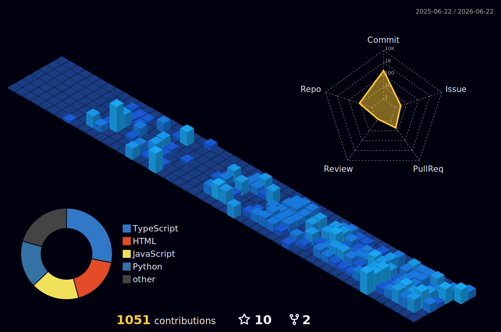

  

<h3> 🚀 念安-Echo | 🌈 Full Stack Developer | 📌 SuZhou </h3>

  <!-- 敲代码动图 -->
  <!--  -->
    

   

  <!-- 社交徽章 -->
  

    &emsp;&emsp;
    &emsp;&emsp;
   &emsp;&emsp;
    &emsp;&emsp;
    

  

  
<b>Technology has the power to make the world a better place</b>

  

---

## 👋 Hi! Nice to meet you!

### 🎉About me
- 💡 I’m **@念安 (Echo)** — a full-stack developer based in **Suzhou, China**  
- 🔭 Passionate about **AI, digital life, and innovative coding projects**  
- 🌱 Always curious and eager to explore new technologies and creative ideas  
- 🎯 Enjoy **building interesting projects and pushing boundaries**
- 📫 If you need any help, you can contact me via WeChat: **waitu1232**

### 🌟 When I’m not coding, you’ll probably find me:  
- 📚 Reading books to gain fresh perspectives  
- 🌍 Exploring the world and experiencing new cultures  
- ✨ Thinking about how technology can blend into everyday life
- 🎲 Anything fun
---

## 🛠️ Tech Stack

Here are some of the tools and technologies I use (and keep learning):  

- **Languages:** Python, Java, JavaScript/TypeScript  
- **Frameworks & Platforms:**  
  - Backend: FastAPI, Spring Boot, Node.js  
  - Frontend: Vue.js, React  
- **Databases:** PostgreSQL, Neo4j, MySQL, OceanBase  
- **AI & Tools:**  
  - FastGPT, RAG, GraphRAG, LightRAG  
  - Neo4j, vector databases, embedding & reranking pipelines  
  - BGE-M3, BGE Reranker  
  - LangChain, SpaCy, Transformers  
  - AI Agent workflows, digital human applications  
  - Docker, Docker Compose, FastAPI, GitHub Actions  

- **Others:**  
  - Git, Linux/WSL, API integration

---

## 🌿 Areas I’m Currently Exploring

- 🚀 Passionate about AI, Knowledge Graphs, and RAG systems
- 🌱 Continuously improving my system design and distributed systems skills
- 🤖 Currently building digital human solutions for Computex, including interactive exhibition experiences and AI digital business cards
- ✈️ Inspired by travel, exploration, and the intersection of technology and real-world experiences
- 🤝 Excited to share my learning journey and collaborate with awesome people

---

## 📈 GitHub Stats
<!-- 两张卡片稳定并排：用表格控制布局 -->

  

<table align="center">
  <tr>
    <td>
      
    </td>
    <td>
      
    </td>
  </tr>
</table>

<table>
  <tr>
    <td>
      <picture>
        <source media="(prefers-color-scheme: dark)" srcset="https://github-readme-activity-graph.vercel.app/graph?username=dandan1232&theme=xcode&bg_color=FF000000&hide_border=true" />
        <source media="(prefers-color-scheme: light)" srcset="https://github-readme-activity-graph.vercel.app/graph?username=dandan1232&theme=xcode&bg_color=FF000000&color=000000&hide_border=true" />
        
      </picture>
  </tr>
</table>

